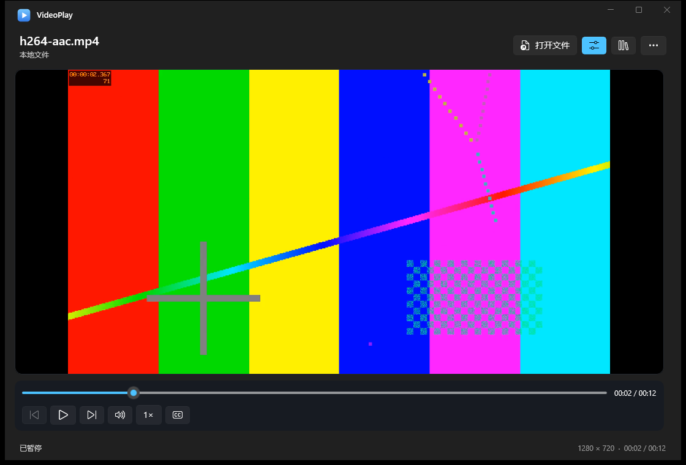
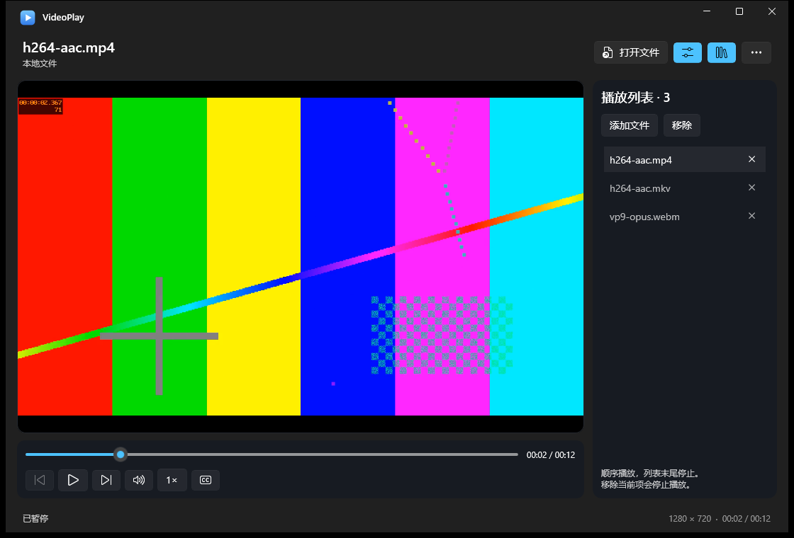
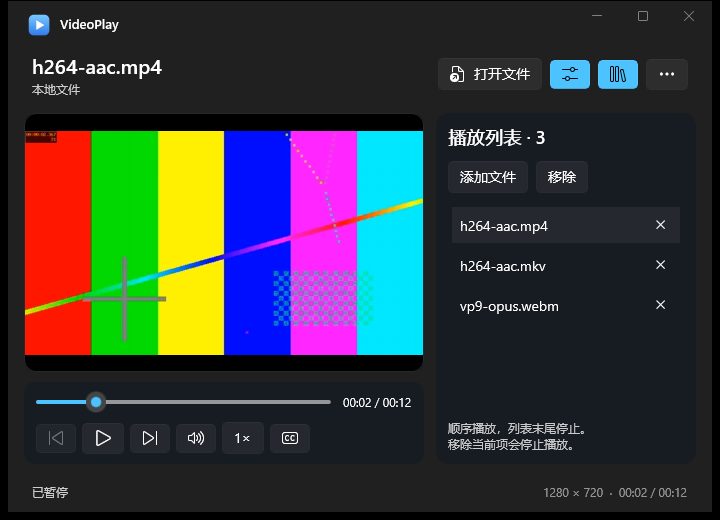
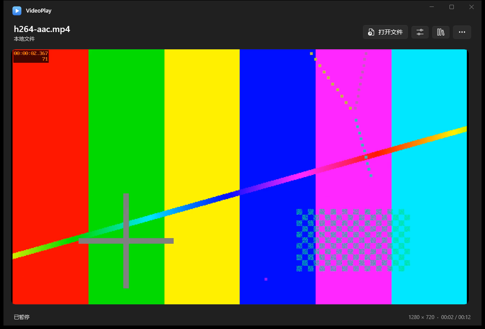

# 2.1 playback controls and playlist validation

This is a review preview, not a release-ready speed milestone. **0.25x still fails the audio/video synchronization check on the test machine.** The failure is retained in the test results; advancing the media clock alone is not counted as successful playback.

## User-visible behavior

The transport bar occupies its own layout row below the video. The header toggle and Ctrl+H hide or restore it, including in full screen. Volume, speed, audio tracks and subtitles are grouped in small flyouts. The playlist is optional and supports multiple local files, independent duplicate entries, selection, removal and previous/next controls. End of media advances to the next item; the final item stops without wrapping. Removing the current item stops playback and never deletes its file. Open replaces the queue; Add appends without interrupting the current item.

The speed setting is retained through pause, seeking and source replacement. Windows' mono rate-processing failure is worked around by duplicating only mono tracks into left/right channels before playback. Other channel layouts are preserved. Accurate seeking avoids snapping the requested position to a nearby keyframe.

## Verification method

Tests ran on Windows 11 x64 build 26200, with .NET SDK 9.0.318, Windows App SDK 1.8.260921001, FFmpegInteropX 2.1.0.81200 and FFmpeg 8.1.2. Real application windows run on private non-input desktops. UI Automation invokes the actual buttons, sliders, selection and file pickers. The playlist suite uses the opt-in pipe to observe state, not to perform playback actions.

`AudioProbe` uses Windows process-loopback capture restricted to the test player's PID and children. A PID is mandatory; there is no desktop-mix or microphone fallback. This verification needs Windows build 20348 or newer and an active output device. Only generated fixtures are opened. Earlier whole-desktop audio recordings are not used as proof of this milestone.

`New-SpeedFixtures.ps1` generates a 60-fps video with simultaneous white-frame/523.25-Hz audio pulses every two media seconds, plus mono AAC, stereo AAC, PCM and audio-free variants. `Analyze-Sync.mjs` compares timestamped rendered pixels against captured audio onsets, requiring at least 80% of observed video onsets to match within 150 ms. Slow-speed observations last long enough to cover multiple pulses. Failing checks produce a nonzero test exit code.

Video samples use `PrintWindow` on only the test player's window, with capture start/end timestamps. This measures application-rendered pixels on a private desktop, not the physical monitor's presentation time. Microsoft documents that the [owning application renders the captured image](https://learn.microsoft.com/en-us/windows/win32/api/winuser/nf-winuser-printwindow). Audio packets use the process-loopback QPC timestamps. The optional `AudioProbe --pipe=VideoPlay-test-...` observer samples the playback clock every 25 ms and reports query duration. Clock correlation is diagnostic only and does not replace the unchanged pixel/audio pass criterion.

```powershell
.\tests\New-MediaFixtures.ps1 -FFmpeg 'C:\tools\ffmpeg.exe' -OutputDirectory '.\TestResults\fixtures'
.\tests\New-SpeedFixtures.ps1 -FFmpeg 'C:\tools\ffmpeg.exe' -OutputDirectory '.\TestResults\speed-fixtures'
dotnet build .\tests\AudioProbe\AudioProbe.csproj -c Release
.\tests\WinUI-PlaylistControls.ps1 -AppDirectory '.\dist\win-x64' `
  -ArtifactsDirectory '.\TestResults\playlist' -FixtureDirectory '.\TestResults\fixtures' `
  -SyncFixtureDirectory '.\TestResults\speed-fixtures' -Dotnet (Get-Command dotnet).Source
```

Use `-Rates @()` for the interaction suite only, `-RateOnly -Rates 0.25,0.5,1,2,5` for rate observations, and `-ScreensOnly` for review screenshots. Run scripts in a PowerShell environment that permits local scripts; changing execution policy is not required.

## Current evidence and remaining limit

- The playback/list interaction run passed 34 checks, including repeated hide/restore, full-screen recovery, duplicate entries, removal, corrupted-media recovery and video without audio. PID audio and rendered-pixel observations also passed after next, replay, paused seeking and resuming at 5x. New media opened at the retained 0.25x setting produced actual sound.
- The native-control regression run passed all 17 checks, including real blocked-file and stalled-network cancellation/replacement, EOF replay, and mute/volume persistence with actual process audio.
- Mono input originally produced zero process audio after any tested non-1x rate change. A minimal program using only Windows `MediaPlayer` and a native `MediaSource` reproduced that result at 0.25x, 1.5x and 2x. Converting the same original fixture to stereo restored sound at 0.25x, 0.5x, 1.5x, 2x and 5x. The application-level mono conversion then restored sound at all four tested endpoints/intermediate rates: 0.25x, 1x, 2x and 5x.
- The installed build passed actual audio and rendered synchronization at 0.5x, 0.75x, 1x, 2x, 3x, 4x and 5x. At 0.25x with automatic video decoding, audio followed video by approximately 180–210 ms, exceeding the unchanged 150-ms criterion. Real-time playback did not resolve it; forced software video decoding was worse (approximately 710 ms). This is an observed limit on this machine, not a claim that Microsoft documents a universal 0.25x limitation.
- The final installed-layout smoke suite passed all 40 checks, including accurate paused seeking, six media formats, real audio/mute/pause output, repeated actions, and HTTP timeout/recovery. Debug rebuild, Release publish and installer compilation succeeded. All 556 published files matched the installed copies by SHA256.

The FFmpeg source is attached to the live playback session following the [upstream sample](https://github.com/ffmpeginteropx/FFmpegInteropX/blob/master/Samples/MediaPlayerWinUI/MainPage.xaml.cs). Audio filters use the library's [per-stream filter API](https://github.com/ffmpeginteropx/FFmpegInteropX/blob/master/Source/FFmpegMediaSource.h). Windows documents rate control via [MediaPlaybackSession.PlaybackRate](https://learn.microsoft.com/en-us/windows/apps/develop/media-playback/play-audio-and-video-with-mediaplayer); it does not promise the measured sync tolerance. Process capture follows Microsoft's [ApplicationLoopback sample](https://github.com/microsoft/Windows-classic-samples/tree/main/Samples/ApplicationLoopback).

Do not merge this as completed full-range synchronized playback until the 0.25x failure is resolved or its scope is explicitly changed. No replacement playback engine or machine-specific timing offset has been introduced. Narrator, high-contrast mode, additional audio endpoints, surround output and production RTSP services still require manual coverage.

| Rate | Median observed A/V offset | Result |
| --- | ---: | --- |
| 0.25x, automatic decoding | 183.0 ms | Fail, 0/3 pulses within 150 ms |
| 0.5x | 107.3 ms | Pass |
| 0.75x | 96.6 ms | Pass |
| 1x | 28.8 ms | Pass |
| 2x | 44.2 ms | Pass |
| 3x | 40.1 ms | Pass |
| 4x | 37.1 ms | Pass |
| 5x | 25.8 ms | Pass, 24/24 pulses |

These are measurements from generated pulse fixtures, not guarantees for every codec, device or media file. The rate harness pauses before setting the next speed and seeking, so a high-speed fixture cannot reach EOF while the next sample is being prepared. Separate interaction checks cover live speed changes and source/EOF transitions.

### Follow-up 0.25x diagnosis

Decoding the source fixture independently with FFmpeg found video and audio pulse onsets at 2, 4, 6, 8 and 10 seconds, aligned within the 16.7-ms video/10-ms audio analysis resolution. The source does not contain the large measured offset. In the live-change run, captured audio remained exactly zero until its onset; the delay was not just a gradual ramp crossing the detector threshold.

| Diagnostic run | Median absolute pixel/audio offset | Observation |
| --- | ---: | --- |
| Current application, live 1x to 0.25x (`-NoSeek`) | 170.7 ms | Fail; video was 3.8-11.7 ms behind the media clock, matched audio onsets 174.8-178.4 ms behind it |
| Pause, change to 0.25x, resume without seeking (`-NoSeek -PauseForRate`) | 168.4 ms; 196.1 ms after returning through 1x | Both fail; pausing alone did not fix the delay |
| Pause, change rate, seek and resume | 135.8 ms | One borderline pass, insufficient to establish a reliable fix |
| Diagnostic native Windows `MediaSource`, stereo input | 139.2 ms | One pass; both outputs lagged the clock (video 123-141 ms, audio 268-270 ms) |
| Diagnostic 256-sample FFmpeg audio frames | 1084.9 ms | Fail with clock stalls; experiment reverted |

The clock queries took about 1 ms and individual pixel captures about 30 ms in these runs. Timing varies between runs; the 150-ms criterion has not been relaxed, and no delay compensation has been added. These results suggest buffering in the audio path, but they do not isolate a specific Windows or FFmpeg component. The packet-size experiment is not in the application. All production code remains identical to the tested preview installer.

The next validation should independently observe the application's composed window on the visible desktop, while keeping PID-only audio capture and coordinating exclusive test-window use. That separates private-desktop capture timing from user-visible synchronization before considering any playback-backend change. Independent review and reliable 0.25x verification remain required before treating the full speed range as complete.

## Actual application screenshots

| Previous WinUI player | Controls below the video |
| --- | --- |
|  |  |

| Optional playlist | Compact 720 x 520 layout |
| --- | --- |
|  |  |


