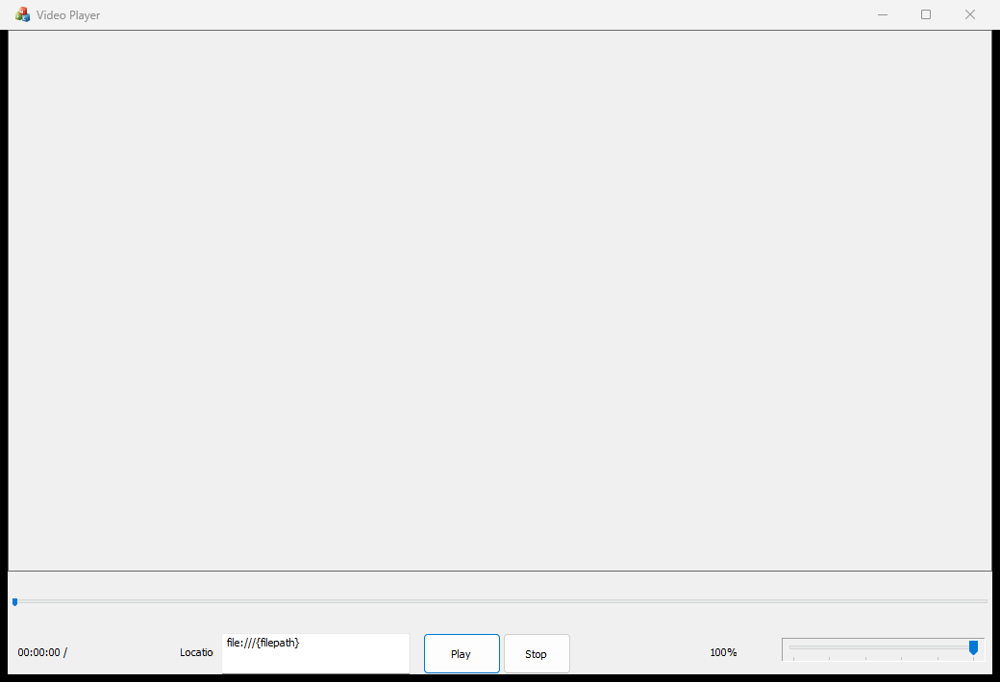
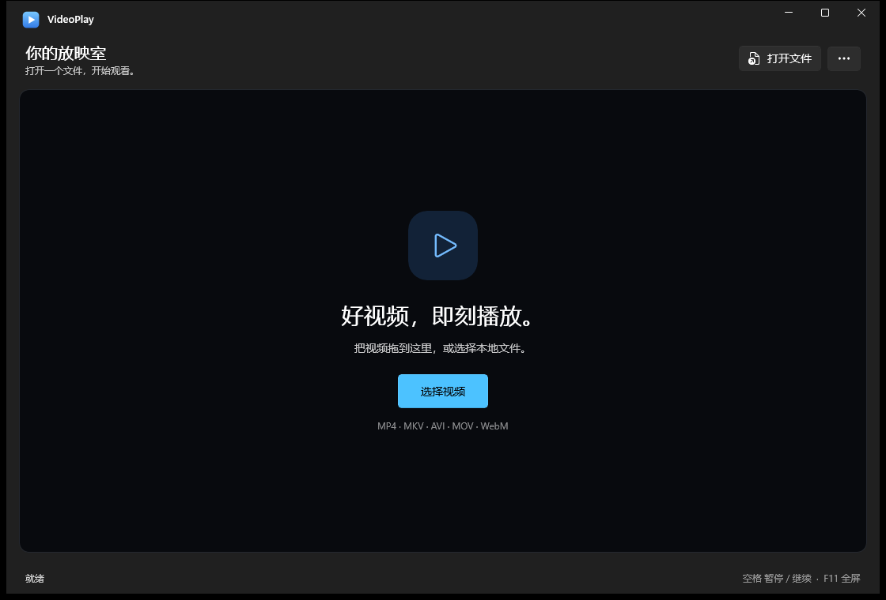
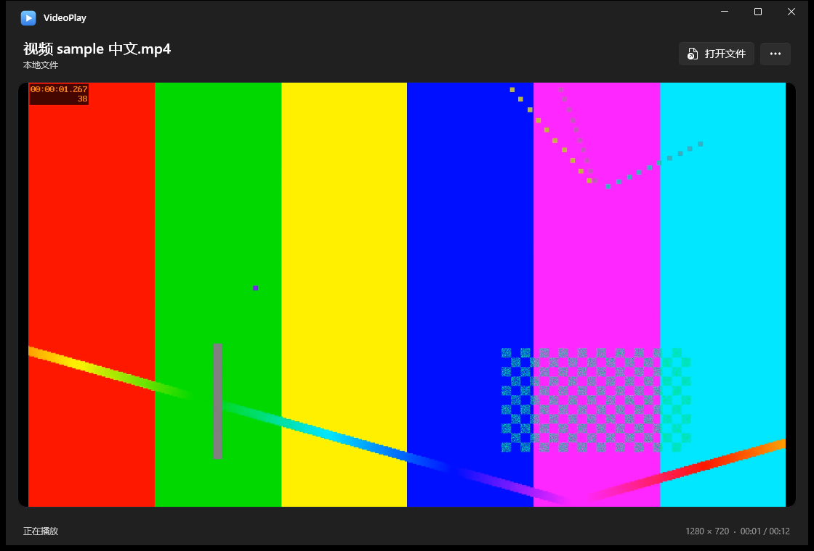
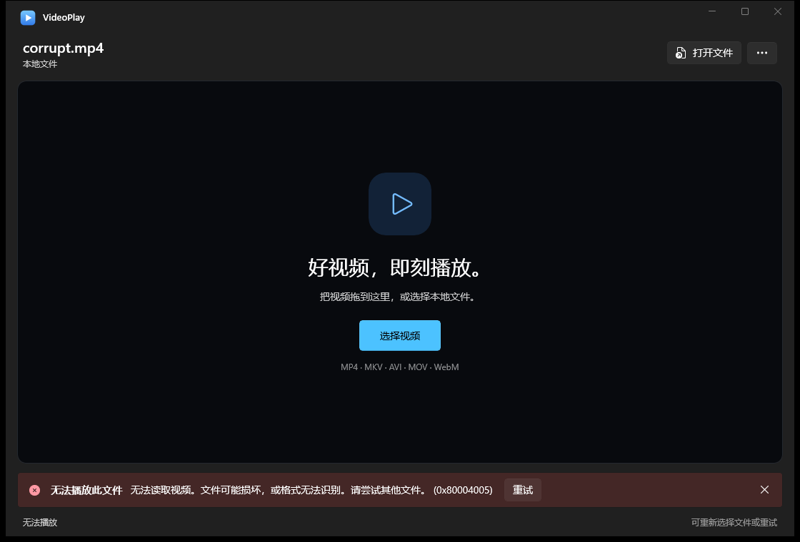

# WinUI 3 playback migration validation

Test environment: Windows 11 x64, build 26200; .NET SDK 9.0.318; Windows App SDK 1.8.260921001; FFmpegInteropX 2.1.0 and FFmpeg 8.1.2. Application tests use non-input private desktops, so no shared desktop window is controlled.

## Implementation and packaging

The new `WinUIPlayer` project uses a real WinUI 3 `MediaPlayerElement` and its native transport controls. FFmpeg supplies the media source and audio/video decoding; the library object is retained throughout playback. The original C++ applications remain separate.

The published layout includes .NET, Windows App SDK, the app's PRI/XBF resources, codec DLLs, and x64 Visual C++ runtime DLLs. The installer is per-user, creates a Start-menu shortcut, has a standard uninstaller, and refuses unrelated nonempty target directories. No global PATH or VLC plugin configuration is needed.

During development, an independent-directory launch caught missing app PRI/XBF files in the normal .NET publish output. The publish target now explicitly copies these generated resources. Native imports were also inspected and application-local C++ runtime files added. These are verified packaging corrections for the new app; the exact cause of the user's old-player black screen cannot be determined without their failing file.

## Reproducible coverage

`tests/WinUI-Smoke.ps1` exercises the actual native application, including the real file picker. It drives the same playback methods as the UI through an explicitly enabled, current-user-only named pipe. It captures real windows with `PrintWindow`, compares pixels inside the video region, and uses WASAPI loopback to verify rendered audio.

The portable-layout run passed 35 checks. The final installed-layout run passed all 40 checks, including five HTTP/stalled-connection checks:

- Startup from an empty working directory, one picker after repeated clicks, cancellation, and a Unicode filename containing spaces.
- H.264/AAC MP4, H.264/AAC MKV, VP9/Opus WebM, HEVC/AAC MP4, MPEG-4/PCM AVI and FLAC.
- Changing, nonblack rendered video pixels for each tested video format.
- The 523.25 Hz AAC test tone appears in actual Windows output (RMS approximately 0.0574); output becomes zero when muted or paused.
- Pause, seek while paused, resume, natural end, replay, full-screen entry/exit and a compact 720 × 520 window.
- Corrupt and missing files, invalid URLs, software decoding, cancellation, rapid source replacement, repeated pause/resume/seek and close during opening.
- Local HTTP playback with changing rendered frames, cancellation of a stalled connection, a bounded timeout, and immediate recovery to a local file.

Release publish and Debug build both completed without compiler warnings/errors. The final installer was installed into a fresh test folder and verified against the published files. Its Start-menu shortcut points to the installed executable and uses its embedded icon. A second installation succeeded; user-added files survived both upgrade and uninstall. Uninstall removed the application, shortcut and registration. An unrelated nonempty folder was rejected without changing its existing file. The temporary installation was removed after testing.

Windows UI Automation exposes named, keyboard-focusable file-open, choose-video and more-options buttons. The composed file-open button has an explicit accessible name. Full Narrator and high-contrast manual testing has not been performed.

## Screenshots

| Original player | WinUI 3 idle |
| --- | --- |
|  |  |

| Actual H.264 playback | Corrupt-file recovery |
| --- | --- |
|  |  |

## Limits

- The user's original failing media file was not supplied; the compatibility evidence uses generated, original fixtures.
- This preview targets x64. ARM64/x86, 4K/HDR, DRM, uncommon subtitle encodings and external production RTSP services have not been validated.
- Windows N/KN requires the Windows Media Feature Pack. The application bundles codecs, but still uses Windows media presentation and audio services.
- The installer is unsigned. No certificate was installed and no release was published.
- Hosted CI builds the self-contained layout; real video/audio/desktop checks require a Windows session with an audio output device.
